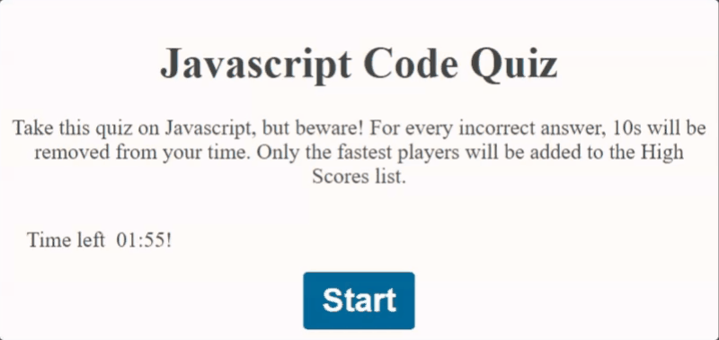

# Code Quiz Website

### Description

This is an exercise in creating a code quiz about Javascript through Javascript.

- [User-Story](##User-Story)
- [Challenge](##Challenge)
- [Screenshots](##Screenshots)
- [Results](##Results)
- [Lessons-Learned](##Lessons-Learned)

## User-Story

AS A coding bootcamp student
I WANT to take a timed quiz on JavaScript fundamentals that stores high scores
SO THAT I can gauge my progress compared to my peers

## Challenge

I was challenged to create a web application to run in browser that would present a quiz about Javascript. The quiz should be timed and allow users to store their highscores.

In keeping with the challenge, the application should be built, as much as possible, in Javascript.

## Screenshots

We were provided with the below gif as a reference for our work.

Upon completion of the task, my on web application can be seen in the image below.

## Results

The required outputs of this project, including this README, the url of the deployed web application and the url of this repo.

- Deployed App - https://spatiality-dc.github.io/code-quiz/

- Github Repo - https://github.com/spatiality-dc/code-quiz

## Lessons Learned

- Javascript is hard.

- Event listeners can only handle one function, but that one function can call other functions. If I had done this, then my event handlers would have been cleaner, but it was very difficult to wrap my head around.
